

# Nahw — Concept Charts (Mermaid)

> **One chart = one concept. Built during teaching when a concept genuinely needs visual representation.**
>
> Rules (full version in CLAUDE.md → Charts discipline):
> - Beginner charts: max 6-8 nodes, 2-3 color roles, NO subgraphs
> - Topic-overview charts (built AFTER all sub-concepts taught): max 16 nodes, one level of subgraph max
> - **Never use comprehensive overview chart to OPEN a topic for a beginner**
> - **I'rab tables → `irab-tables.md`, NOT here.** Mermaid is for trees, processes, dependency parses, concept maps.

---

## Standard `classDef` palette (paste into every chart)

> Niche sample tree palette aur shapes demo karta hai:

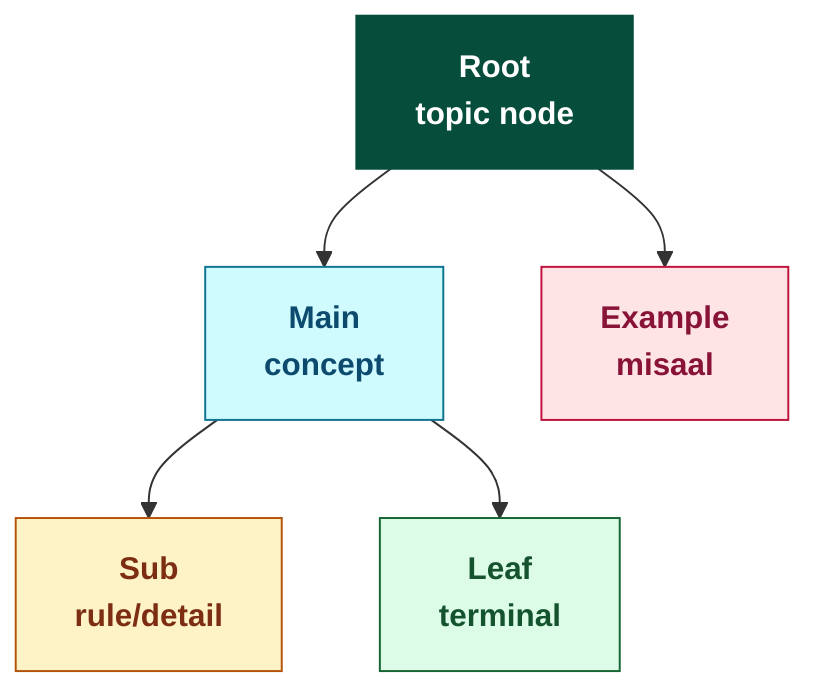

Apne charts mein sirf wahi `classDef` lines paste karein jo zaroori hain.

Semantics (never deviate):
- **root** = topic node
- **main** = main concept
- **sub** = rule / detail
- **leaf** = terminal leaf
- **ex** = example

---

## Chart index

| # | Chart | Source pages | Added |
|---|-------|---------------|-------|
| 1 | Kalimah → 3 qismein (Mufrad taxonomy) | PDF p-06, p-07 | 2026-05-28 |
| 2 | Lafz → Mauzu'/Muhmal → Mufrad/Murakkab (parent context) | PDF p-06, p-07 | 2026-05-28 |
| 3 | Jumla Khabariya → Ismiya / Fi'liya (with elements) | PDF p-08 | 2026-05-28 |
| 4 | Jumla Insha'iya → 10 qismein (with one example each) | PDF p-09, p-10 | 2026-05-28 |
| 5 | Murakkab Ghair Mufid → 3 qismein (Idafi/Bina'i/Mana' Sarf) | PDF p-10, p-11 | 2026-05-28 |
| 6 | Mu'arrab-Mabni concrete demo (Zayd 3 forms + Hadha 3 forms) | PDF p-16 | 2026-05-28 |
| 7 | Alamat-e-Ism (11 alamat grouped) | PDF p-14 | 2026-05-28 |
| 8 | Fasl 2 review — Jumla ki 2 taqseemein (Zaati 4 + Sifati 6) | PDF p-12, p-13 | 2026-05-28 |
| 9 | Alamat-e-Fi'l (8) + Alamat-e-Harf (negative + 3 link-types) | PDF p-15 | 2026-05-28 |
| 10 | **Mudmaraat (Qism #1) full taxonomy** — 3 i'rab × 2 attachment patterns × 6 paradigm tables × 14 forms = 84 total | PDF p-18, p-19, p-20 | 2026-05-30 |
| 11 | **Asma-e-Mausoolah (Qism #2)** — 10 forms (gender × number) + 3 exceptions + Sila rule | PDF p-20 | 2026-05-30 |
| 12 | **Asma-e-Ishara (Qism #3)** — 10 forms (Qareeb × Ba'eed × gender × number) + Mushar Ilayh rule | PDF p-21 | 2026-05-30 |

---

## Chart 1 — Kalimah (Mufrad) taxonomy

**Source:** PDF p-06 (Kalimah ki 3 qismein + Ism tareef + Ism ki 3 qismein), p-07 (Jamid/Masdar/Mushtaq + Fi'l + Harf tareefein + Harf ki 2 qismein).

**Concept:** *کلمہ ki 3 qismein* + un mein se Ism aur Harf ki andruni qismein. Yeh **Mufrad branch** ka mukammal review chart hai (Murakkab branch alag chart mein aayega).

**Read karne ka tareeqa:**
- **Sabz emerald** (root) = topic
- **Teal** (main) = 3 buniyadi qismein
- **Amber** (sub) = rule / cross-reference
- **Green** (leaf) = terminal qismein

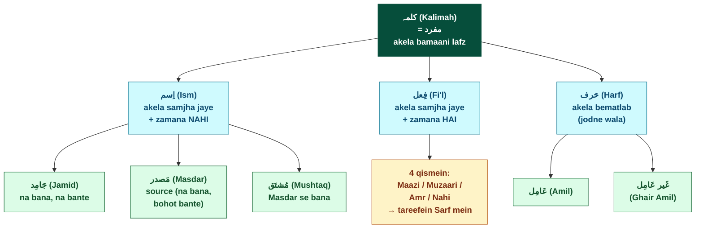

**Density check (CLAUDE.md rules):**
- 10 nodes (limit: 16 for topic-overview) ✅
- 4 classDefs (limit: 5) ✅
- No subgraphs ✅
- Each Arabic label paired with Roman transliteration ✅

**Kaise istemaal karein:**
- Chart kholo → kisi bhi node par dekho → us ki tareef yaad karo (notes.md mein dekhna minus points)
- "Fi'l ki 4 qismein" wala amber box reminder hai ke yeh aage Sarf book se aata hai
- Khali nodes (jaise Amil/Ghair Amil) jin ki tareef abhi nahi mili — yeh **placeholders** hain Bab 2 ke liye

**Aage ke charts** (Chart 2-5 batch — added 2026-05-28 after Fasl 1 mukammal hua):
- ✅ Chart 2 (added below)
- ✅ Chart 3 (added below)
- ✅ Chart 4 (added below)
- ✅ Chart 5 (added below)

---

## Chart 2 — Lafz parent tree (Mauzu'/Muhmal + Mufrad/Murakkab)

**Source:** PDF p-06 (Lafz tareef + Mauzu'/Muhmal + Mufrad/Murakkab), p-07 (Mufrad=Kalimah + Murakkab=Jumla equivalence).

**Concept:** Chart 1 ke "above" wala context — Kalimah aur Jumla kahaan se aate hain. Yeh **Fasl 1 ka master overview** hai. Leaf nodes (Chart 1, 3, 4, 5) ki taraf reference karte hain.

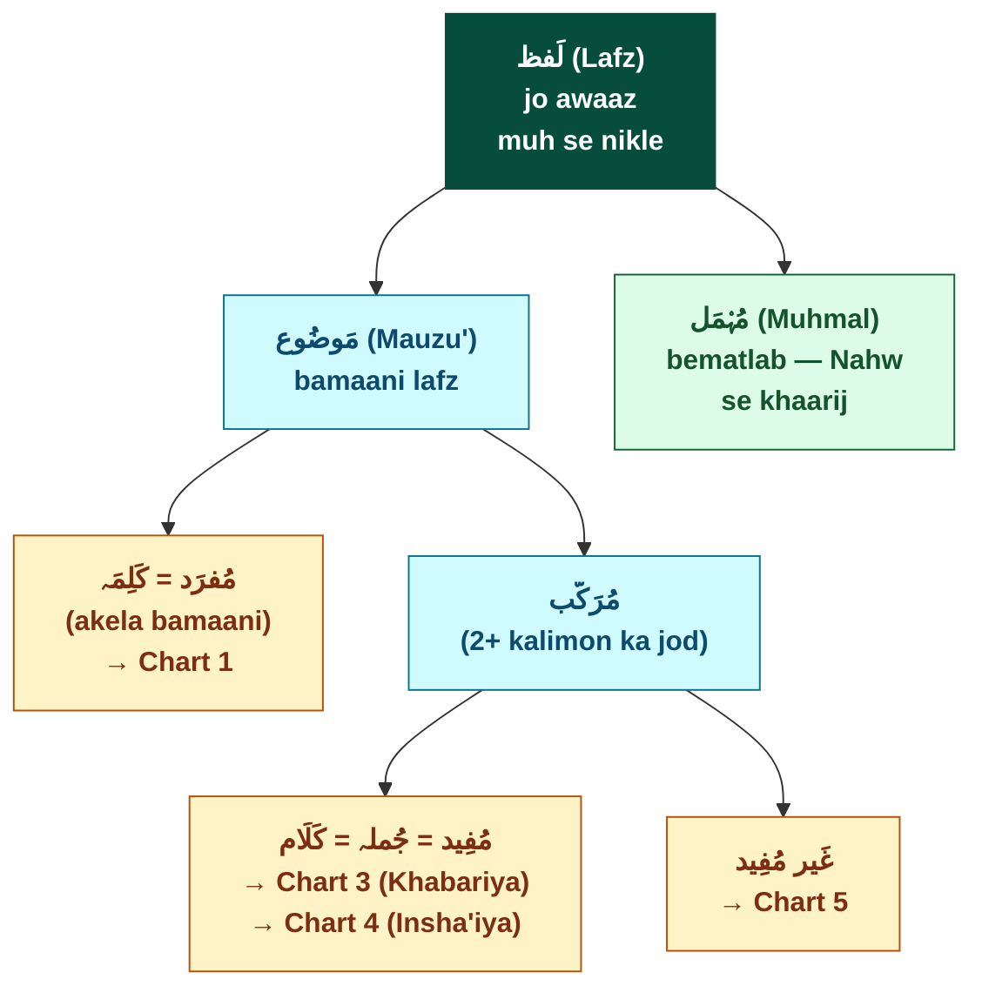

**Density check:** 7 nodes, 4 classDefs, no subgraphs. ✅

**Kaise istemaal:** Bara picture dekhne ke liye — Kalimah aur Kalam dono ki taxonomical position dikhata hai. Detailed sub-trees ke liye linked charts dekho.

---

## Chart 3 — Jumla Khabariya structure (Ismiya / Fi'liya + elements)

**Source:** PDF p-08 (Khabariya tareef + Ismiya/Fi'liya + Mubtada/Khabar/Fi'l/Fa'il + Musnad/MI cross-labels).

**Concept:** Jumla Khabariya ke 2 qismein aur har qism ke 2 ajzaa kya naam rakhte hain. Examples included.

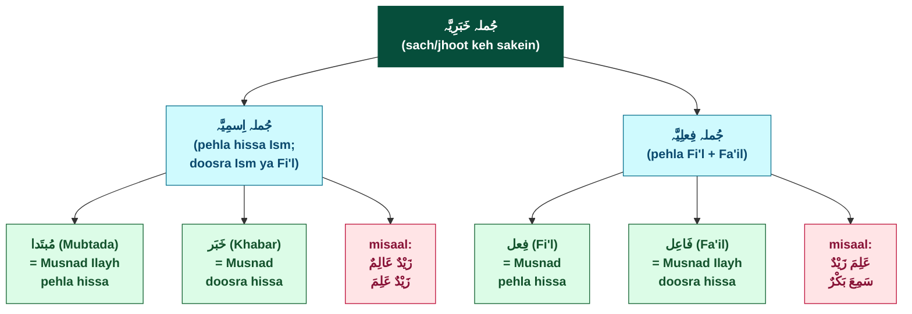

**Density check:** 9 nodes, 4 classDefs, no subgraphs. ✅

**Mukhya insight is chart se:** Ismiya aur Fi'liya ke elements ke 2-2 naam hote hain — ek "general" (Musnad/MI) aur ek "context-specific" (Mubtada-Khabar / Fi'l-Fa'il). Yeh aapko ek hi structure ko 2 lenses se dekhna sikhata hai.

**Note (chart mein nahi):** Insha'iya bhi Jumla ki qism hai, lekin Khabariya se elements alag hain (Insha'iya mein Mubtada/Khabar wali structure nahi hoti generally). Insha'iya ka apna chart hai (Chart 4).

---

## Chart 4 — Jumla Insha'iya ki 10 qismein

**Source:** PDF p-09 (qismein 1-6) + p-10 (qismein 7-10).

**Concept:** Insha'iya ki 10 sub-qismein, har ek ka ek-line description + Arabic example. **Yeh chart ka density limit (16) ke qareeb hai — review chart, beginner-open chart NAHI.**

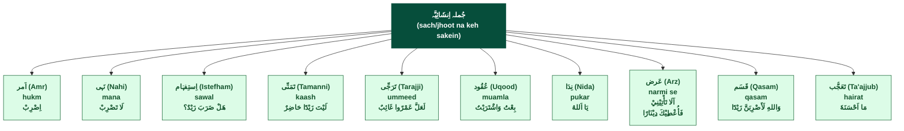

**Density check:** 11 nodes, 2 classDefs, no subgraphs. ✅

**Memory mnemonic (chart ke baahar — 5 pairs):**
| Pair | Qismein |
|------|---------|
| Hukm | Amr / Nahi |
| Khwahish | Tamanni / Tarajji |
| Sawal/Muamla | Istefham / Uqood |
| Pukar/Narmi | Nida / Arz |
| Qasam/Hairat | Qasam / Ta'ajjub |

---

## Chart 5 — Murakkab Ghair Mufid → 3 qismein

**Source:** PDF p-10 (Ghair Mufid tareef + 3 qismein + Idafi tafseel) + p-11 (Bina'i khaatma + Mana' Sarf tareef + examples).

**Concept:** Ghair Mufid ki 3 sub-qismein ka distinguishing features ke saath comparison.

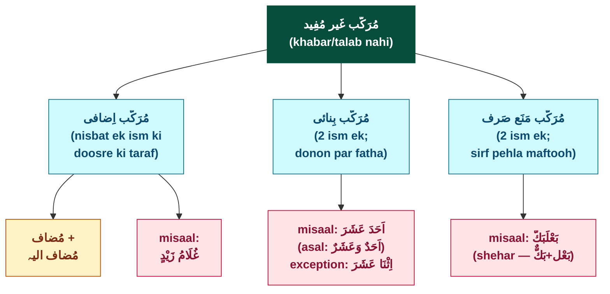

**Density check:** 8 nodes, 4 classDefs, no subgraphs. ✅

**Bina'i vs Mana' Sarf farq table** (chart ke baahar):

| | Bina'i | Mana' Sarf |
|--|--------|-------------|
| 2 ism ek? | ✅ | ✅ |
| Rabt-wala harf? | ❌ | ❌ |
| Harakaat | **Dono** fatha | **Sirf pehla** maftooh |
| Word-type | Numbers 11-19 (PDF: *"أَحَدَ عَشَرَ سے تِسْعَۃَ عَشَرَ تک"*) | Shehar ka naam (PDF misaal sirf بَعْلَبَكُّ) |
| Misaal | اَحَدَ عَشَرَ | بَعْلَبَكُّ |

---

## Chart 6 — Mu'arrab vs Mabni: Concrete demo (Zayd 3 forms + Hadha 3 forms)

**Source:** PDF p-16 (Mu'arrab + Mabni tareefein + Mahall-e-I'rab + Zayd 3-form walkthrough + Hadha 3-form walkthrough — Block 4 + Block 5).

**Concept:** Section 11 ka **pivot example** visually. Same lemma (Zayd or Hadha) ko 3 jumlon mein dekho — Mu'arrab walay (Zayd) ka akhri **harakah** badalta (zer/zabar/pesh), Mabni walay (Hadha) ka kuch nahi badalta. Yeh chart i'rab system ki **foundation concept** dikhata.

**Read karne ka tareeqa:**
- **Sabz emerald** (root) = central question
- **Teal** (main) = Mu'arrab side (badalta) vs Mabni side (yaksaan)
- **Amber** (sub) = key insight (mahall-e-i'rab)
- **Pink** (ex) = book ke 6 misaal jumlay

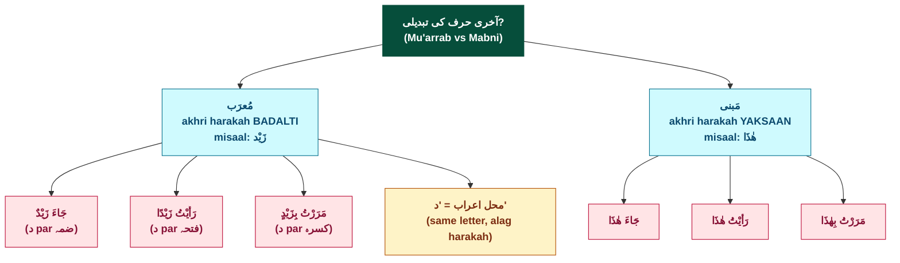

**Density check (CLAUDE.md rules):**
- 10 nodes (limit: 16 for topic-overview) ✅
- 4 classDefs (limit: 5) ✅
- No subgraphs ✅

**Kaise istemaal karein:**
- Mu'arrab side dekho — 3 misaal jumlon mein **akhri harakah** par focus (ٌ → ً → ٍ).
- Mabni side dekho — har misaal mein **هٰذَا exactly same** form.
- Mahall-e-i'rab insight: "د" (akhri letter) **same** rehta, harakah par change aata. Yeh i'rab ka **mechanism** hai.

**Cross-reference:** Section 11 (PDF p-16) ka full narrative walkthrough.

---

## Chart 7 — Alamat-e-Ism: 11 alamat in 4 thematic groups

**Source:** PDF p-14 (11 alamat-e-Ism with book ki misaalein).

**Concept:** Ism pehchanne ke 11 signs. 4 thematic groups mein arrange:
- **Word-edge markers** (kinaaron par dikhne wale): alamat #1-3
- **Syntactic role markers** (jumlay mein role): alamat #4-5
- **Morphological forms** (Sarf-side derivational): alamat #6-9 — forward-refs Sarf
- **Quality + femininity markers**: alamat #10-11

Yeh **identification toolkit** chart hai — koi Arabic lafz dekho, in 11 mein se koi bhi alamat milay, to woh **Ism** hai.

**Read karne ka tareeqa:**
- **Sabz emerald** (root) = Ism
- **Teal** (main) = 4 thematic groups
- **Green** (leaf) = 11 alamat with PDF misaalein

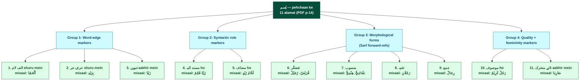

**Density check:** 16 nodes (limit: 16 for topic-overview ✅), 3 classDefs, no subgraphs ✅.

**Note on Group 3** (Morphological forms): Sarf book mein in 4 forms ki tafseel hai (Musaghghar/Mansoob/Tathniya/Jam'). Yahaan sirf naam + PDF misaal — yeh **identification signs** ke taur par hain, tafseeli morphology Sarf side ka kaam.

**4-group framing (chart ke baahar):** *(yeh 4-group thematic arrangement meri taraf se hai — book ne 11 alamat bina grouping ke list ki; grouping pedagogically helpful)*

**Harakaat verification (2026-05-29 direct PDF re-read):** Pichle round mein 2 validator queries uthayi thin (`بِزَیْدِ` vs `بِزَیْدٍ`, `رَجُلَانِ` vs `رَجُلَان`). 2026-05-29 ko **direct PDF p-14 image re-read** ne dono resolve kiye:
- **A2 example `بِزَیْدِ`**: PDF par `د` ke neeche **single kasra** (ek diagonal stroke) clear hai — NOT tanween-kasra. Chart aur Section 9 ka reading correct hai. **RESOLVED.**
- **A8 example `رَجُلَانِ`**: PDF par final `ن` ke neeche **kasra** dikhayi deti hai. Chart aur Section 9 ka reading correct hai. **RESOLVED.**
- **Pattern note** (memory-fill-patterns.md): Native validators ki harakaat-reading bias — jab validator finding ambiguous PDF image se conflict kare, builder ka direct PDF re-read final hota hai. Yeh chart par confirmation cycle ka canonical example bana.

---

## Chart 8 — Fasl 2 review: Jumla ki 2 taqseemein

**Source:** PDF p-12 (Zaati 4 qismein + Sifati heading + Mubaiyana start), p-13 (Sifati qismein 2-6 mukammal).

**Concept:** Fasl 2 ka **complete picture**. Jumla ko **2 alag aitebar** se taqseem karna:
- **بااعتبارِ ذات** (zaati — by inherent structure): 4 qismein → "اصل جملہ"
- **بااعتبارِ صفت** (sifati — by role/quality): 6 qismein

Yeh **topic-overview** chart hai — built after sub-concepts taught.

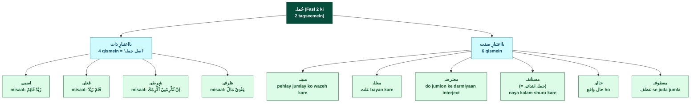

**Density check:** 13 nodes (limit: 16 ✅), 3 classDefs ✅, no subgraphs ✅.

**Kaise istemaal:** Jumla dekho — 2 alag perspectives se classify karo. Zaati side se "wo asmiya ya fi'liya ya shartiya ya zarfiya?" Sifati side se "wo kis role mein hai — wazeh kar raha, علت bata raha, interject, naya shuru, حال, ya atf?"

---

## Chart 9 — Alamat-e-Fi'l (8) + Alamat-e-Harf (negative + 3 link-types) combined

**Source:** PDF p-15 (8 alamat-e-Fi'l with Arabic+Urdu glosses + علامتِ حرف negative def + 3 link-type misaalein).

**Concept:** Fi'l aur Harf ki identification toolkit — Chart 7 (Ism) ka complement.
- **Fi'l side**: 8 positive alamat (particle-prefix + structural + sigha-based)
- **Harf side**: 1 negative criterion + 3 link-type examples (Ism-Ism / Ism-Fi'l / Fi'l-Fi'l)

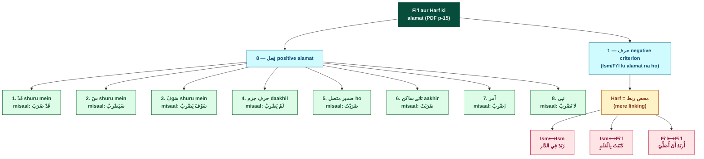

**Density check:** 14 nodes (limit: 16 ✅), 5 classDefs (limit: 5 ✅), no subgraphs ✅.

**Kaise istemaal:** Koi Arabic lafz dekho — Chart 7 ki 11 Ism-alamat se start; agar koi na milay, Fi'l ki 8 alamat (yeh chart) check karo; agar koi na milay, **automatically Harf** hai. Phir Harf ka kaam = linking (یہاں 3 link-types dikhaye).

---

## Chart 10 — Mudmaraat (Qism #1 of 8) full taxonomy

**Source:** PDF p-18 (Section 13 — Mudmaraat ki 5 qismein), p-19 (Section 14 — Mansoob + Majroor sub-types), p-20 (Section 15 — Majroor bi Idafa completion + MUKAMMAL claim).

**Concept:** Fasl 5 ka pehla qism — **مُدْمَرَات** ki full taxonomy. **3 i'rab states** (Marfu'/Mansoob/Majroor) × **attachment patterns** (Muttasil/Munfasil) → **6 paradigm tables** × 14 forms each = **84 forms total**. Note: Marfu' + Mansoob ke 2-2 tables (Muttasil + Munfasil), Majroor ka sirf Muttasil hai magar 2 sub-types (bi Harf-e-Jarr + bi Idafa) — isliye 5 qismein lekin 6 tables.

**Read karne ka tareeqa:**
- **Sabz emerald** (root) = main qism
- **Teal** (main) = 3 i'rab states
- **Green** (leaf) = 6 paradigm tables with misaal-form

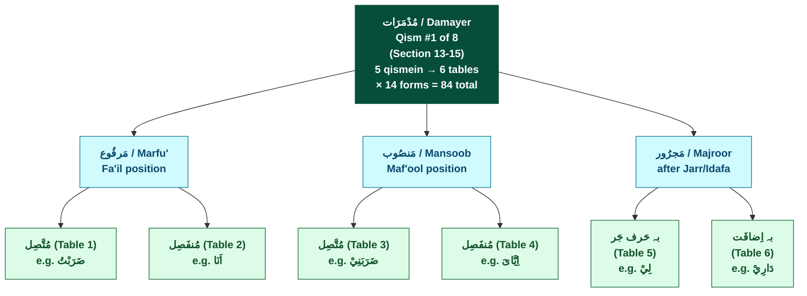

**Density check:** 10 nodes (limit: 16 ✅), 3 classDefs (limit: 5 ✅), no subgraphs ✅.

**Kaise istemaal:** Yeh **structural taxonomy** hai (84 forms ka full paradigm `irab-tables.md` Tables 1-6 mein hai). Chart se yaad karo ke har "qism" actually 2 dimensions ka intersection hai (i'rab × attachment). Mudmaraat MUKAMMAL hone ka **structural map**.

---

## Chart 11 — Asma-e-Mausoolah (Qism #2 of 8) — paradigm + exceptions + Sila rule

**Source:** PDF p-20 (Section 15 — Mausoolah ki 10-form paradigm + 3 exceptions + Sila tareef).

**Concept:** Fasl 5 ka doosra qism — **اَسْمَائے مَوْصُوْلَہ** ki taxonomy. **10 paradigm cells** in PDF p-20 table: **7 gender-specific** (3 masculine + 4 feminine) + **2 generic** (مَنْ/مَا) + **1 dual-form cell** (اَيٌّ/اَيَّۃٌ — also one of the 3 exceptions). Sath mein **3 special rules**: الف لام as اَلَّذِيْ in Ism Fa'il/Maf'ool, ذُو in Banu Tay, اَيٌّ/اَيَّۃٌ Mu'arrab+Idafa-only. Plus **Mausool+Sila** compound-unit rule (Section 15 ka root concept). **Note** *(yeh book ki structure se observation)*: اَيٌّ/اَيَّۃٌ **dual-role** rakhta — paradigm ka 10th cell AND exception list ka 1st item.

**Read karne ka tareeqa:**
- **Sabz emerald** = main qism
- **Teal** (main) = 2 specificity branches
- **Amber** (sub) = compound-unit rule + exceptions header
- **Green** (leaf) = actual form clusters

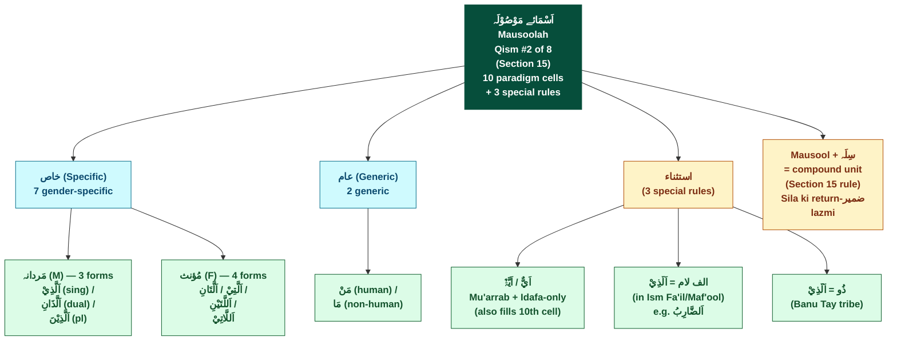

**Density check:** 11 nodes (limit: 16 ✅), 4 classDefs (limit: 5 ✅), no subgraphs ✅.

**Kaise istemaal:** Mausool jab dekho — pehle pehchaano specific (gender-based) ya generic (مَنْ/مَا)? Phir Sila zaroori (ek complete jumla with return-ضمیر). Compound unit ki tarah istemaal — alag se kaam nahi karta. 3 exceptions yaad rakho ke ye non-standard cases hain.

---

## Chart 12 — Asma-e-Ishara (Qism #3 of 8) — paradigm gender × number × distance

**Source:** PDF p-21 (Section 16 — Ishara Qareeb 5 + Ba'eed 5 + Mushar Ilayh tareef).

**Concept:** Fasl 5 ka teesra qism — **اَسْمَائے اِشَارَہ** ki taxonomy. **2 sub-qismein** (Qareeb/Ba'eed — distance) × **gender** (m/f/common) × **number** (sing/dual/plural) → **10 total forms**. Sath mein **Ishara+Mushar-Ilayh** compound-unit rule (Section 16 ka root concept).

**Read karne ka tareeqa:**
- **Sabz emerald** = main qism
- **Teal** (main) = 2 distance branches
- **Green** (leaf) = 10 individual forms (5 + 5)
- **Amber** (sub) = compound-unit rule

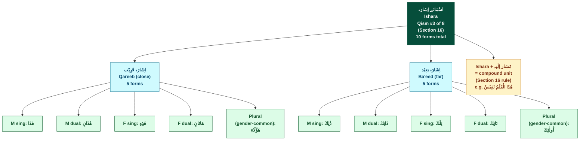

**Density check:** 14 nodes (limit: 16 ✅), 4 classDefs (limit: 5 ✅), no subgraphs ✅.

**Kaise istemaal:** Koi Ishara form dekho — pehle distance pehchaano (Qareeb 5 forms ya Ba'eed 5 forms — chart se match karo). Phir gender + number breakdown. Plural form **gender-common** hai (m + f dono ke liye same lafz). **Mushar Ilayh** Ishara ke saath compound unit banata (Mausool+Sila ke same pattern par — Section 16 cross-pattern observation).

**Builder pattern observation** *(mera observation; book ne yeh tabseera nahi diya)*: Qareeb forms usually **هٰ-** prefix se shuru (هٰذَا/هٰذَانِ/هٰذِهِ/هٰؤُلَاءِ — magar هَاتَانِ exception); Ba'eed forms usually **-كَ** suffix se khatam (ذٰلِكَ/ذَانِكَ/تِلْكَ/تَانِكَ/اُولٰئِكَ — yeh consistent hai). Yeh **heuristic** hai, formal rule nahi.

---

## Aage ke charts (Fasl 5 MUKAMMAL ke baad — 2026-05-30 update)

**Status update**: Charts 1-12 ab build ho chuke. Fasl 1 + 2 + 3 + Fasl 4 pivot + **Fasl 5 ke pehle 3 qismein (Mudmaraat/Mausoolah/Ishara)** — sab visual review done.

**Pending future charts** (next phases mein):
- **Chart 13 candidate**: Ism Ghair Mutamakkin **8 qismein full taxonomy tree** — Fasl 5 ka topic-overview chart (ab build kiya ja sakta kyunke saari 8 qismein covered).
- **Chart 14 candidate**: Mabni-ending classification (Section 20 Faida 1) — visual grouping of all Zarf items by damma/fatha/kasra/sukoon.
- **Chart 15+ candidates**: Aage ke pages (p-26+) ke naye concepts ke saath new charts emerge honge:
  - Mabni-Mu'arrab full taxonomy tree (Mabni-al-Asl 3 + Mushabahat 4 tareeqein) — Section 12 conceptual map
  - Case-state names (Marfu'/Mansoob/Majroor) — Bab-level i'rab system overview
  - Amil / Ma'mool chart (jab Ma'mool ki tareef milti — p-12 ka 4th forward-ref still pending)
