

# Sarf — Concept Charts (Mermaid)

> **One chart = one concept. Built during teaching when a concept genuinely needs visual representation.**
>

> - Beginner charts: max 6-8 nodes, 2-3 color roles, NO subgraphs
> - Topic-overview charts (built AFTER all sub-concepts taught): max 16 nodes, one level of subgraph max
> - **Never use comprehensive overview chart to OPEN a topic for a beginner**
> - **Paradigm tables (gardaan) → `gardaan-tables.md`, NOT here.** Mermaid is for trees, processes, concept maps only.

---

## Standard `classDef` palette (paste into every chart)

> Niche sample tree palette aur shapes demo karta hai:

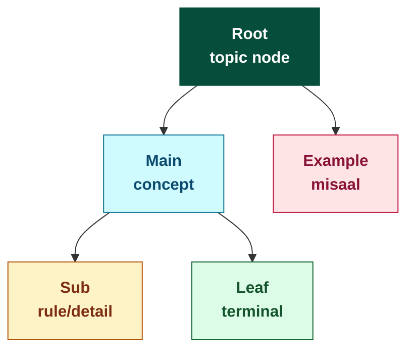

Apne charts mein sirf wahi `classDef` lines paste karein jo zaroori hain.

Semantics (never deviate):
- **root** = topic node
- **main** = main concept
- **sub** = rule / detail
- **leaf** = terminal leaf
- **ex** = example

---

## Chart index

*(Built up session by session. One chart per teaching session at most.)*

| # | Concept | Source | Added |
|---|---|---|---|
| 1 | Kalimah → 3 aqsam (Ism / Fi'l / Harf) | Sarf p-019, Slide 7 + p-021 Slide 10 | 2026-05-28 |
| 2 | Fi'l ki 3 taqseemein (topic-overview) | Sarf p-020, Slides 8-9 | 2026-05-28 (backfill) |
| 3 | Huroof ki taqseem (harkat ke aitebar se) | Sarf p-022, Slide 12 | 2026-05-28 (backfill) |
| 4 | Huroof Tahajji → Sahih / Illat (Waa'i mnemonic) | Sarf p-021, Slide 11 | 2026-05-28 |
| 5 | Masdar derivation tree (1 masdar → 6 fi'l + 6 ism, with نصر-based misaalein) | Sarf p-023 Slides 16-17 + p-024 Slides 18-19 | 2026-05-28 |
| 6 | Wazn extraction system (Mauzun ↔ Meezan ↔ Wazn + 3 kalimah labels + Asli/Zaa'idah pehchaan + 2 anchor examples) | Sarf p-025 Slides 22-23 | 2026-05-29 |

---

## Chart 1 — Kalimah ki 3 aqsam

**Concept:** Arabic mein har lafz (kalimah) 3 mein se ek qism hai: **Ism** (naam), **Fi'l** (kaam), **Harf** (rabt/connector).

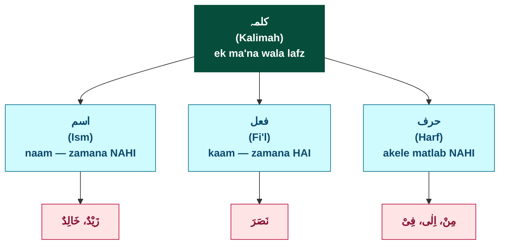

**Reading guide:**
- **Root (gehra emerald)** — Kalimah, jo top concept hai
- **Main (teal)** — 3 aqsam: Ism, Fi'l, Harf
- **Example (pink)** — book ke misaal: Zayd/Khalid (Ism, Slide 7), Nasara (Fi'l, Slide 7), Min/Ila/Fi (Harf, Slide 10)

---

## Chart 2 — Fi'l ki 3 taqseemein (topic-overview)

**Concept:** Fi'l ko **3 mukhtalif aitebar** se taqseem kiya jata hai. Slides 8-9 par yeh 3 taqseemein listed hain — har taqseem ki 2-2 qismein. Ek hi Fi'l in teeno mein analyze ho sakta hai.

**Source:** Sarf PDF p-020, Slides 8 + 9 (combined topic-overview).

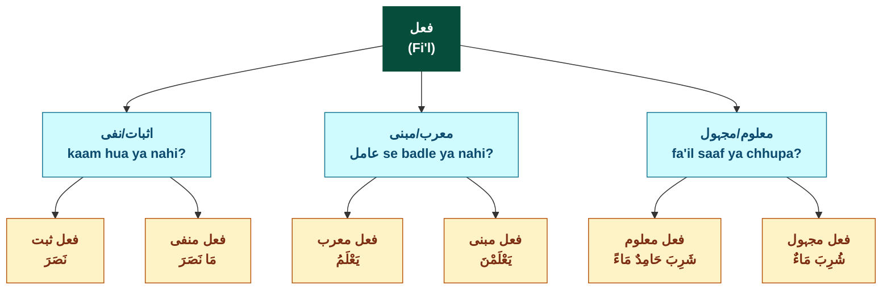

**Reading guide:**
- **Root (emerald)** — Fi'l, top concept
- **Main (teal)** — 3 aitebar (3 axes of classification)
- **Sub (amber)** — 6 leaf qismein, har ek PDF misaal ke saath

**Mohim baat:** Ek hi Fi'l in **teeno aitebar** mein simultaneously analyze hota hai. e.g., **نَصَرَ** = **ثبت** (positive) + **مبنی** (Maazi mostly mabni) + **معلوم** (fa'il "wo" saaf).

**Density:** 10 nodes, 3 color roles, no subgraphs — within 16-node topic-overview limit.

---

## Chart 3 — Huroof ki taqseem (harkat ke aitebar se)

**Concept:** Sarf ke nuqta-nazar se huroof ko 4 qismein mein taqseem kiya jata hai — harakah (vowel mark) ke hone, na-hone, shadda, ya tanwin par based. Mutaharrik aur Munawwan ki 3-3 sub-types bhi.

**Source:** Sarf PDF p-022, Slide 12.

**Type:** Topic-overview chart with 1-level sub-classification.

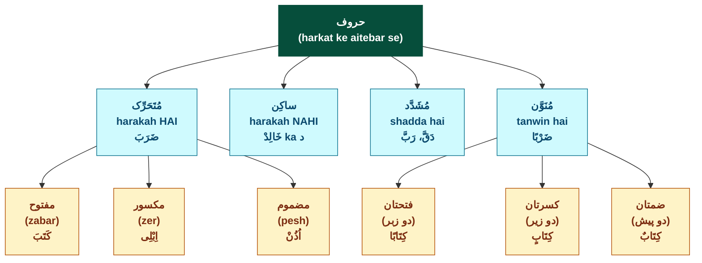

**Reading guide:**
- **Root (emerald)** — Huroof (harkat-based classification)
- **Main (teal)** — 4 qismein: Mutaharrik, Saakin, Mushaddad, Munawwan
- **Sub (amber)** — Mutaharrik aur Munawwan ki 3-3 sub-types (Saakin aur Mushaddad ki sub-types nahi hain)

**Mohim baat:** **Saakin** aur **Mushaddad** terminal hain (sub-types nahi). **Mutaharrik** mein zer/zabar/pesh ke aitebar se 3 sub. **Munawwan** mein 2-zer/2-zabar/2-pesh ke aitebar se 3 sub.

**Density:** 11 nodes, 3 color roles, no subgraphs — within 16-node topic-overview limit.

---

## Chart 4 — Huroof Tahajji → Sahih / Illat (Waa'i mnemonic)

**Concept:** Arabic alphabet (**حروف تہجی**) ki 2 qismein hain — **حروف صحیح** (25, ek shakal mein) aur **حروف علت** (3 = و، ا، ی; shakal badalti hai). Illat huroof ko "بیماری" kaha jata hai (Arab istilah) — kyunke jaise bimaar ka haal badalta, isi tarah yeh shakal badalte. Yeh Sarf ka **foundational concept** hai — aage gardaan mein "irregular" verbs ka asal sabab.

**Type:** Beginner taxonomy chart (5 nodes — within max 6-8 beginner limit).

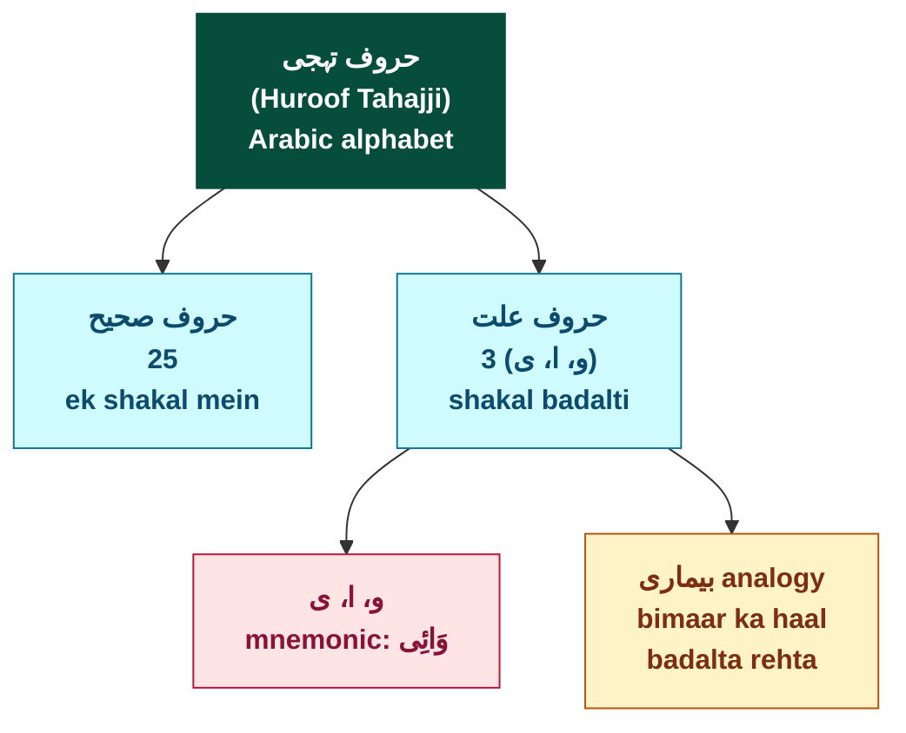

**Reading guide:**
- **Root (emerald)** — Huroof Tahajji (Arabic alphabet) — kalimah ki bunyaad
- **Main (teal)** — 2 qismein: Sahih (25, fixed shakal) vs Illat (3, badalti shakal)
- **Example (pink)** — Illat ke 3 huroof: **و، ا، ی** + mnemonic **وَائِی** (Waa'i)
- **Sub (amber)** — Arab "بیماری" analogy explaining WHY Illat huroof shakal badalte hain

**Mohim baat (Sarf ke liye CRUCIAL):**

> Aage Sarf mein jab **gardaan** shuru hoga, **Illat-walay verbs** (jin mein و، ا، ی hain) "irregular" lagein ge. **Yeh isi wajah se** — kyunke yeh "bimaari" huroof shakal badalte hain. **Chart 4 is foundational** for understanding all future irregular verb paradigms.

**Density:** 5 nodes, 4 color roles, no subgraphs — well within beginner limits.

---

## Chart 5 — Masdar derivation tree (Sub Topic 1.3 topic-overview)

**Concept:** **Ek masdar se 12 cheezein mushtaq hoti hain — 6 فعل aur 6 اسم.** Yeh Sub Topic 1.3 ka **root statement** hai (Slide 16 Note). Chart har leaf par sigha ka naam + نصر-based misaal dikhata hai — taki student "ek lafz se itni shakalein" ka concept visually grasp kare. **Yeh "asal Sarf" ka pehla complete tree hai** — aage ke saare paradigms iss concept ka extension hain.

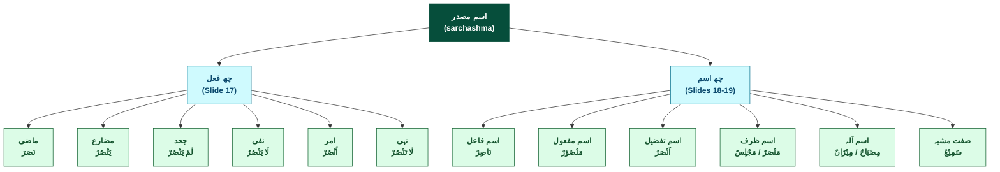

**Reading guide:**
- **Root (emerald)** — **اسم مصدر** — derivation ka sarchashma (class concept, koi specific example label nahi — examples leaves par hain)
- **Main (teal)** — 2 branches matching PDF titles: **چھ فعل** (Slide 17 PDF: *"اسم مصدر سے بننے والے چھ فعل"*) + **چھ اسم** (Slides 18-19 PDF: *"اسم مصدر سے بننے والے چھ اسم"*)
- **Leaf (green)** — 12 mushtaq cheezein, har ek nَصْرًا masdar se derived نصر-based misaal ke saath:
 - **6 fi'l** (left branch): Madhi (نَصَرَ) / Mudaari' (یَنْصُرُ) / Jahd (لَمْ یَنْصُرْ) / Nafi (لَا یَنْصُرُ) / Amr (اُنْصُرْ) / Nahi (لَا تَنْصُرْ)
 - **6 ism** (right branch): Faail (نَاصِرٌ) / Maf'ul (مَنْصُوْرٌ) / Tafzeel (اَنْصَرُ) / Zarf (مَنْصَرٌ + مَجْلِسٌ) / Aalah (مِصْبَاحٌ + مِیْزَانٌ) / Sif-e-Mush (سَمِیْعٌ)

**Mohim baat — yeh chart kyun important hai:**

> Sub Topic 1.3 ka pura raaz ek tasveer mein: **ek hi masdar (نَصْرًا) se 12 mukhtalif shakalein** banti hain. Chart dekh kar 2 cheezein samjho:
> - **Pehchaan** — kisi bhi Arabic lafz ko dekh kar uski **qism** identify karna (yeh ism faail hai ya maf'ul ya tafzeel ya...).
> - **Cross-root pattern** — alag-alag roots se same qism par bane hue ism aapas mein "saga" hote hain. Slide 19 ka matching exercise yahi sikhata hai (e.g., نَاصِر-عَالِم dono faail; مَنْصُوْر-مَضْرُوْب dono maf'ul). Yeh **morphological pattern** ka concept hai — Sub Topic 1.4+ mein book formally introduce karega (abhi sirf observation level par).

**Verbatim discipline checks:**
- **Saare 12 Arabic misaalein** PDF se verbatim:
 - 6 fi'l (نَصَرَ، یَنْصُرُ، لَمْ یَنْصُرْ، لَا یَنْصُرُ، اُنْصُرْ، لَا تَنْصُرْ) — PDF p-023 Slide 17 ki table se.
 - 6 ism (نَاصِرٌ، مَنْصُوْرٌ، اَنْصَرُ، مَنْصَرٌ + مَجْلِسٌ، مِصْبَاحٌ + مِیْزَانٌ، سَمِیْعٌ) — PDF p-024 Slides 18-19 ki tareef-rows se.
- **Branch labels** (چھ فعل / چھ اسم) — Slide 17 + 18 ki titles se PDF-verbatim.
- **Root node text** "اسم مصدر / (sarchashma)" — Slide 16 ki tareef use karta hai (term "اسم مصدر" PDF-verbatim hai); "(sarchashma)" Roman Urdu chart reading aid hai (chart label, not transcription).

---

*Next chart candidates: (a) **Mushtaqqaat extended chart** — agar Sub Topic 1.4 mein wazn ka formal taaruf aaye, to wazn-centric companion chart bana sakte. (b) **Topic 1.0 closure overview** — agar saare 7 Sub Topics complete hon to ek combined map. (c) Per Sub Topic 1.4 content emerge ho.*

---

## Chart 6 — Wazn extraction system (Sub Topic 1.4 topic-overview)

**Concept:** **Wazn nikaalne ka pura system ek tasveer mein** — Mauzun (input), Meezan (yardstick: ف،ع،ل), Wazn (output) ke 3 buniyadi terms ka relationship + Meezan ke 3 root letter labels (Fa/Ain/Lam Kalimah) + Mauzun ke letters ki Asli vs Zaa'idah pehchaan + 2 PDF anchor examples (عِلْمٌ → فِعْلٌ = saare asli case; عَالِمٌ → فَاعِلٌ = with-zaa'idah case). **Sub Topic 1.4 ka complete summary**. Sub Topic 1.5 ne confirm kiya ke yahi method فعل par bhi apply hota — yaani yeh chart universal.

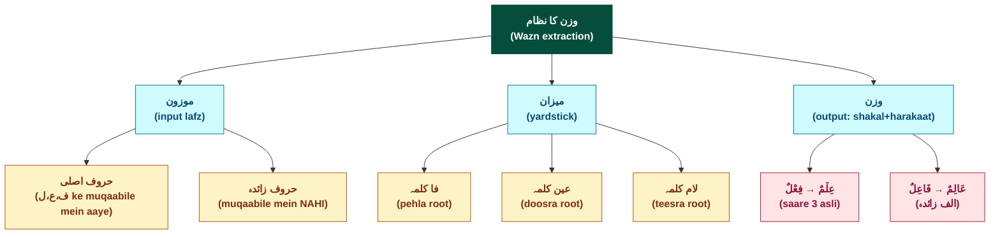

**Reading guide:**
- **Root (emerald)** — *وزن کا نظام* — overall framework ka naam (chart-structural — PDF par yeh exact phrase nahi, lekin Sub Topic 1.4 title se derived).
- **Main (teal)** — 3 buniyadi terms PDF Slide 22 verbatim: **موزون** (input — wo lafz jis ka wazn nikalna ho), **میزان** (yardstick: ف،ع،ل ka template), **وزن** (output — murattab shakal + harakaat).
- **Sub (amber)** — terminology + categories:
 - **Meezan ki sub-parts (PDF Slide 23)**: 3 root letter labels — **فا کلمہ** (pehla root letter = ف ke muqaabile mein), **عین کلمہ** (doosra = ع), **لام کلمہ** (teesra = ل).
 - **Mauzun ki sub-categorization (PDF Slide 23)**: jo letters meezan ke muqaabile mein aayein = **حروف اصلی**; jo na aayein = **حروف زائدہ**.
- **Examples (rose)** — 2 PDF Slide 23 anchor examples:
 - **عِلْمٌ → فِعْلٌ**: saare 3 letters (ع،ل،م) ف،ع،ل ke muqaabile mein hain → **all asli** case.
 - **عَالِمٌ → فَاعِلٌ**: middle alif ف،ع،ل ke muqaabile mein nahi → **with-zaa'idah** case (الف = اسم فاعل ki علامت, per Slide 23).

**Mohim baat — yeh chart kyun important hai:**

> Sub Topic 1.4 ka pura concept ek tasveer mein: **wazn extraction = mauzun ki shakal + meezan ki kasoti + asli/zaa'idah pehchaan.** Chart dekh kar 3 cheezein samjho:
> - **Method universal hai** — Sub Topic 1.5 ne confirm kiya: jaisa اسم par wazn nikalte, waisa hi فعل par bhi nikalte. Yeh chart دونوں par apply hota.
> - **Root letter identification** — kisi bhi Arabic lafz ko dekh kar **kaunse 3 letters root hain** aur **kaunse extra** — yeh foundational skill hai jo har future Sarf topic mein chahiye.
> - **عَالِمٌ → فَاعِلٌ wala alif** — extra letter ki "significance" — yahi علامت concept hai. Sub Topic 1.3 ke ism qismein (faail, maf'ul, tafzeel, etc.) is alag-alag علامتيں hi distinguish karti hain.

**Density:** 11 nodes (1 root + 3 main + 5 sub + 2 examples), 4 color roles (root/main/sub/ex), no subgraphs — within 16-node topic-overview limit.

**Verbatim discipline checks:**
- **All Arabic terms PDF-verbatim:**
 - 3 buniyadi terms (موزون، میزان، وزن) — Slide 22 verbatim.
 - 3 kalimah labels (فا کلمہ، عین کلمہ، لام کلمہ) — Slide 23 verbatim.
 - 2 categories (حروف اصلی، حروف زائدہ) — Slide 23 verbatim.
 - 4 example Arabic words (عِلْمٌ، فِعْلٌ، عَالِمٌ، فَاعِلٌ) — Slide 23 verbatim with full harakaat.
- **Roman Urdu in labels** = minimal chart-structural reading aids ("input lafz", "yardstick", "output", "pehla/doosra/teesra root", "muqaabile mein") — NOT PDF claims.
- **Root node label** (*وزن کا نظام*) — chart-structural framework name, not a PDF claim. Marked as such in Reading guide.
- **NO baab names, NO wazn nomenclature beyond Slide 23 attested forms, NO forward-projected concepts.**

---

## Chart 7 — چھ ابواب overview (Sub Topic 1.5 topic-overview)

**Concept:** **Sub Topic 1.5 ka pura concept ek tasveer mein** — 3 ماضی waznein (فَعَلَ / فَعِلَ / فَعُلَ) se algebraic derivation ke zariye **3 + 2 + 1 = 6 ابواب** bante hain. Har باب ki **unique wazn-pair** (ماضی + مضارع combination) + book ka **canonical misaal** dikhaya gaya. **Yeh classical Sarf ka structural foundation hai** — har future Sarf topic 6 ابواب ke ander hi work karta hai.

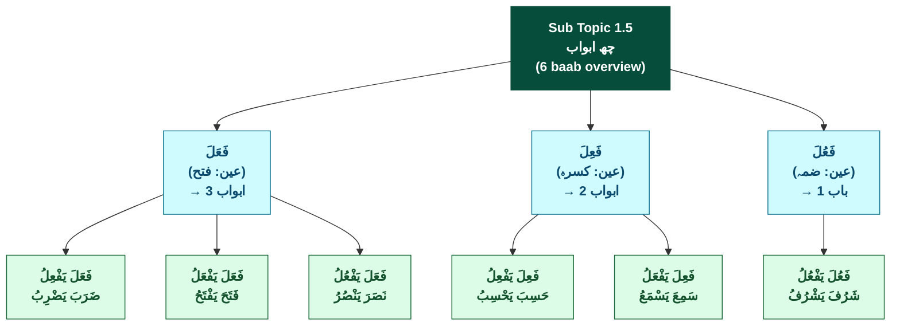

**Reading guide:**
- **Root (emerald)** — **چھ ابواب** ka Sub Topic-level branding (Slide 30 closing line *"ان کو چھ باب کہتے ہیں"* PDF-attested concept + Sub Topic 1.5 title bar *"فعل کے چھ ابواب"*).
- **Main (teal)** — 3 ماضی waznein based on **عین کلمہ ki harakah** (PDF Slide 30 Paragraphs 1-3 verbatim):
 - **فَعَلَ** (عین par فتح) → 3 ابواب bante hain (Slide 30 Table 1, ۱-۲-۳).
 - **فَعِلَ** (عین par کسرہ) → 2 ابواب bante hain (Slide 30 Table 2, ۴-۵ — damma wala pairing missing).
 - **فَعُلَ** (عین par ضمہ) → 1 باب banta hai (Slide 30 Table 3, ۶ — fatha aur kasrah wale pairings dono missing).
- **Leaf (green)** — 6 canonical ابواب (PDF Slide 31 canonical 2×3 table se), har leaf mein 2 lines (Slide 31 cell ka exact structure):
 - **Upar**: wazn-pair (ماضی + مضارع combination, Slide 31 cell ke upri line se).
 - **Neeche**: canonical misaal (Slide 31 cell ke nichli line se).

**Mohim baat — yeh chart kyun important hai:**

> Sub Topic 1.5 ka pura **algebraic raaz** ek tasveer mein: **3 ماضی waznein × possible مضارع variations = 6 ابواب**. Chart dekh kar 3 cheezein samjho:
> - **Asymmetry visible** — فَعَلَ se teeno مضارع waznein possible (3 ابواب); فَعِلَ se sirf 2 (damma wala missing); فَعُلَ se sirf 1 (sirf damma-damma pair). Yeh asymmetry Slide 30 ka core structural insight hai — 9 logical combinations se sirf 6 مستعمل hain.
> - **Wazn-pair = باب ki identity** — har باب ki "fingerprint" uska unique ماضی+مضارع wazn-pair hai. Misaal sirf canonical reference hai — **wazn-pattern fixed, misaal-lafz flexible** (jaisa Slide 31 Note ne alternates bhi diye: e.g., کَرُمَ یَکْرُمُ for شَرُفَ یَشْرُفُ in some books; مَنَعَ یَمْنَعُ for فَتَحَ یَفْتَحُ; etc.).
> - **Foundation for everything** — har future Sarf topic (conjugation paradigms, مزید فیہ, مجرد derivatives, مجہول forms, etc.) is **6 ابواب structure ke ander hi work** karega. Yeh chart pehli "complete classification" hai jise Sarf rasm se سَب learners yaad karte hain.

**Verbatim discipline checks:**
- **All Arabic terms PDF-verbatim:**
 - 3 ماضی waznein (فَعَلَ، فَعِلَ، فَعُلَ) — Slide 30 verbatim with full harakaat.
 - 3 Urdu harakah-naam (فتح، کسرہ، ضمہ) — Slide 30 Paragraphs 1-3 verbatim (book ne exactly yeh 3 alfaaz use kiye).
 - 6 wazn-pairs (فَعَلَ یَفْعِلُ، فَعَلَ یَفْعَلُ، فَعَلَ یَفْعُلُ، فَعِلَ یَفْعِلُ، فَعِلَ یَفْعَلُ، فَعُلَ یَفْعُلُ) — Slide 31 cells verbatim.
 - 6 canonical misaalein (ضَرَبَ یَضْرِبُ، فَتَحَ یَفْتَحُ، نَصَرَ یَنْصُرُ، حَسِبَ یَحْسِبُ، سَمِعَ یَسْمَعُ، شَرُفَ یَشْرُفُ) — Slide 31 cells verbatim.
- **Roman Urdu in labels** = minimal chart-structural reading aids ("Sub Topic 1.5", "(6 baab overview)", "→ 3 ابواب / → 2 ابواب / → 1 باب" arrow counts, "(عین: فتح/کسرہ/ضمہ)" position-harakah disambiguation) — NOT PDF claims.
- **Root node label** ("Sub Topic 1.5 / چھ ابواب / (6 baab overview)") — derived from Sub Topic 1.5 title bar + Slide 30 closing line. PDF-derivable Sub Topic-level branding.
- **NO "باب X" naming convention** in leaf labels — Slide 31 cells par sirf "wazn-pair + canonical misaal" hai, "باب ضَرَبَ" / "باب فَتَحَ" style formal label nahi tha (per Sub Topic 1.5 notes ka Slide 31; "باب X" naming convention notes mein **** flag ke saath documented hai). Chart structurally PDF-faithful — sirf wazn-pair + misaal.

- **شَرُفَ NOT کَرُمَ** — book ka primary 6th misaal **شَرُفَ یَشْرُفُ** hai (Slide 31 verbatim). **کَرُمَ یَکْرُمُ** Slide 31 Note ke alternate-list mein hai (*"بعض کتب میں مستعمل"* — doosri kitabon ka standard). Chart **book ki primary** use karta —) NAHI plant kiya. **: canonical names PDF-attested se hi use,.
- **NO Slide 33 علامات terminology** (مفتوح العین / مکسور العین / مضموم العین) — Slide 33 chart mein cited NAHI hai, isliye Slide 33-specific terminology bhi NAHI use ki. Slide 30 ka simple "عین کلمہ ka فتح/کسرہ/ضمہ" wording hi chart node labels mein.
- **NO Slide 29 9-logical vs 6-مستعمل framework** — Slide 29 chart mein cited NAHI hai (p-027 cite nahi kiya), isliye us slide ka explicit framework chart mein nodes ke roop mein nahi. Asymmetry insight Mohim baat section mein narrative form mein zikr hua (commentary, not node).

- (a) Saare 6 canonical misaalein ki harakaat letter-by-letter Slide 31 cells se match — khaas: **حَسِبَ** (ح fatha + س kasrah + ب fatha — yeh باب ۴ ka definitional check); **شَرُفَ** (ش fatha + ر damma + ف fatha — ر par damma critical, kyunki yeh عین کلمہ ki position hai); **سَمِعَ** (س fatha + م kasrah + ع fatha — yeh باب ۵).
- (b) Saare 6 wazn-pairs ki harakaat — khaas: **فَعَلَ یَفْعِلُ** ka یَفْعِلُ ka عین par kasrah (یا fatha + فا sukoon + عین kasrah + لام damma); **فَعِلَ یَفْعِلُ** ka فَعِلَ ka عین par kasrah; **فَعُلَ یَفْعُلُ** ka فَعُلَ ka عین par damma.
- (c) Slide 30 ka **3-paragraph structure** + closing line "یہ کل چھ سیٹ ہیں، ان کو چھ باب کہتے ہیں" confirmed.
- (d) **شَرُفَ vs کَرُمَ canonical choice** — Slide 31 ka primary **شَرُفَ** hi hai (Note ne کَرُمَ ko *"بعض کتب میں مستعمل"* kaha tha, NOT primary). Chart book ki primary respect karta.
- (e) Slide 31 ka **2×3 RTL cell layout** confirmed — top row RTL ۱-۲-۳ = ضَرَبَ/فَتَحَ/نَصَرَ; bottom row RTL ۴-۵-۶ = حَسِبَ/سَمِعَ/شَرُفَ. Chart leaf ordering Slide 31 numbering ke per.

---

---

## Chart 11 — Sub Topic 1.6 combined ششش اقسام (ism + fi'l asymmetry overview)

**Concept:** **Sub Topic 1.6 ka pura concept ek tasveer mein** — حروف اصلی (مادہ) ke اعتبار se اسم aur فعل ki classifications. **Ism side**: 3 main sizes (ثلاثی/رباعی/خماسی) × مجرد/مزید فیہ = **6 qismein** (ششش اقسام). **Fi'l side**: 2 main sizes (ثلاثی/رباعی — **NO خماسی فعل** structural asymmetry) × مجرد/مزید فیہ = **4 qismein**. Combined **6 + 4 = 10 actual qismein**, lekin Sub Topic ka branding "**ششش اقسام**" hai (= 6 ism, naam ism-side se aaya). **Yeh foundational asymmetry (ism mein 5-letter possible, fi'l mein nahi) chart visually highlight karta**.

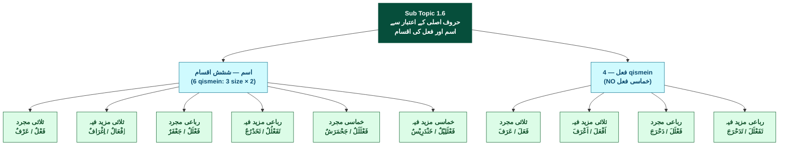

**Reading guide:**
- **Root (emerald)** — **Sub Topic 1.6 branding** + dou-side scope declaration (اسم AUR فعل) per Slide 36 compressed header "اسم اور فعل کی اقسام".
- **Main (teal)** — 2 branches:
 - **اسم — ششش اقسام (6 qismein)**: PDF Slide 36 ne 3 main qismein (ثلاثی/رباعی/خماسی) × مجرد/مزید فیہ = 3×2=6 ka master rule diya; "ششش اقسام" Sub Topic-level branding (Persian/Urdu variant of "شش" = 6, per S8 spelling-variant pattern preserved).
 - **فعل — 4 qismein (NO خماسی فعل)**: PDF Slide 38 ne fi'l side ki 2 main qismein (ثلاثی + رباعی) × مجرد/مزید فیہ = 2×2=4 ka master rule diya. **خماسی فعل nahi hota** — Sub Topic 1.6 ka foundational asymmetry insight. Sub Topic-level branding "ششش اقسام" header bars mein retained hota even on fi'l side slides.
- **Leaf (green)** — 10 terminal classifications, har leaf mein 2 lines:
 - **Upar**: wazn (PDF-verbatim Slide 37 / Slide 39 ki tareef se).
 - **Neeche**: canonical misaal (PDF-verbatim Slide 37 / Slide 39).
- **اسم branch leaves (6)**: ثلاثی مجرد (عَرْفٌ) + ثلاثی مزید فیہ (اِغْرَافٌ) + رباعی مجرد (جَعْفَرٌ) + رباعی مزید فیہ (تَخَدْرُجٌ) + خماسی مجرد (جَحْمَرَشٌ) + خماسی مزید فیہ (خَنْدَرِیْسٌ — wazn + misaal PDF-attested per Slide 37; PDF zaayid-letter callout says "ی" زائد).
- **فعل branch leaves (4)**: ثلاثی مجرد (عَرَفَ) + ثلاثی مزید فیہ (اَعْرَفَ) + رباعی مجرد (دَحْرَجَ) + رباعی مزید فیہ (تَدَحْرَجَ).

**Mohim baat — yeh chart kyun important hai:**

> Sub Topic 1.6 ka **dou-side classification + asymmetry insight** ek tasveer mein. Chart dekh kar 3 cheezein samjho:
> - **Asymmetry visible** — ism side ki 6 leaves vs fi'l side ki 4 leaves. **خماسی فعل ka column missing** hai — yeh structural rule classical Sarf ka hai (max 4 root letters fi'l mein). Yeh visual asymmetry student ko foundational fact yaad karwati hai.
> - **مجرد vs مزید فیہ ka uniform pattern** — har size par (ثلاثی, رباعی, خماسی) **2-way split**: roots-only (مجرد) vs roots+extras (مزید فیہ). Pattern dono sides par identical, sirf khaas khanji zaayid letters har case ke liye specific hain (ہمزہ + الف / ت / ی / etc.).
> - **Wazn vs misaal cross-mapping** — har leaf par wazn (structural template) + misaal (PDF-canonical example) jod ke dikhaya. Future Sarf topics mein har leaf apni paradigms develop karega — yeh chart starting point hai.

**Verbatim discipline checks:**
- **All Arabic terms PDF-verbatim:**
 - 10 qism names (ثلاثی مجرد / ثلاثی مزید فیہ / رباعی مجرد / رباعی مزید فیہ / خماسی مجرد / خماسی مزید فیہ across ism; ثلاثی مجرد / ثلاثی مزید فیہ / رباعی مجرد / رباعی مزید فیہ on fi'l) — Slide 37 + Slide 39 verbatim.
 - 10 waznein (فَعْلٌ / اِفْعَالٌ / فَعْلَلٌ / تَفَعْلُلٌ / فَعْلَلَلٌ / فَعْلَلِیْلٌ for ism; فَعَلَ / اَفْعَلَ / فَعْلَلَ / تَفَعْلَلَ for fi'l) — Slide 37 + 39 verbatim with full harakaat.
 - 10 misaalein (عَرْفٌ / اِغْرَافٌ / جَعْفَرٌ / تَخَدْرُجٌ / جَحْمَرَشٌ / خَنْدَرِیْسٌ for ism; عَرَفَ / اَعْرَفَ / دَحْرَجَ / تَدَحْرَجَ for fi'l) — Slide 37 + 39 verbatim.
 - "ششش اقسام" (3 ش letters) — book ki spelling variant preserved per S8 (standard Persian "شش" = 6, book uses ششش consistently across all Sub Topic 1.6 slides + Sub Topic-level branding).
- **Roman Urdu in labels** = minimal chart-structural reading aids ("(6 qismein: 3 size × 2)", "(NO خماسی فعل)") — these are chart-structural disambiguation NOT PDF claims. "(NO خماسی فعل)" reflects Slide 38's structural fact (fi'l mein 4 qismein only, ism mein 6).
- **Root node label** ("حروف اصلی کے اعتبار سے اسم اور فعل کی اقسام") — derived from Slide 36 compressed header sub-heading. PDF-attested.
- **NO خَنْدَرِیْسٌ zaayid letter prefix** in chart leaf — keep at wazn + misaal level only; zaayid-letter callout (`[?]` per notes — "ی" / "نی" / "یا" ambiguity Slide 37 PDF callout small/unclear) is forward detail in notes, NOT in chart node label. Rule 4 compliant.
- **NO 6 ابواب cross-reference** to Sub Topic 1.5 — Sub Topic 1.5 ke 6 canonical ابواب structurally ثلاثی مجرد فعل hain, but only (notes mein documented as fenced). Chart 11 stays within Sub Topic 1.6 scope.

Nazir physical book se final-confirm kare per Slide 37 + 39 verbatim discipline checks listed in respective notes Status blocks.

---

## Chart 12 — Sub Topic 1.7 هَفْت اقسام master tree (7 categories + positional rule + sub-types overview)

**Concept:** **Sub Topic 1.7 ka pura هَفْت اقسام (7 categories) framework ek tasveer mein** — مزاج حروف (letters ki nature: علت / ہمزہ / تضعیف) ke اعتبار se کلمات ki **exhaustive classification**. Har category ka **positional rule** (kis position par kya hai: fa/ع/lam) + **sub-types** (where applicable) + **canonical misaal** ek leaf mein consolidated. Chart **4 distinct sub-typing conventions** ko bhi visually surface karta (حرف علت letter / علت positions adjacency / ہمزہ position / root letter count) — Sub Topic 1.7 ki **architectural richness** ka indicator.

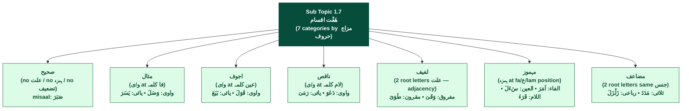

**Reading guide:**
- **Root (emerald)** — **هَفْت اقسام Sub Topic-level branding** (Slide 42 paragraph 1: *"اصطلاحاً صرف میں ان کو هَفْت اقسام کہتے ہیں"*). S8 spelling variant "هَفْت" (Arabic-style heh) preserved verbatim. Compact descriptor "(7 categories by مزاج حروف)" reflects Sub Topic 1.7 title.
- **Leaf (green)** — 7 terminal categories, har leaf mein 3 lines:
 - **Line 1**: Category name (Arabic, PDF-verbatim).
 - **Line 2**: Positional rule / structural rule (compact Roman + Arabic mix).
 - **Line 3**: Sub-types (if any) + canonical fi'l misaal per sub-type.
- **Leaf details (PDF cross-link summary)**:
 - **صحیح** (Slide 42) — triple-NO condition (na علت / na ہمزہ / na تضعیف), misaal صَبَرَ
 - **مثال** (Slides 42 + 43) — 2 sub-types: مثال واوی (وَصَلَ) + مثال یائی (یَسَرَ)
 - **اجوف** (Slides 42 + 43) — 2 sub-types: اجوف واوی (قَوَلَ) + اجوف یائی (بَیَعَ) — morphological-root forms (S10 preservation)
 - **ناقص** (Slides 42 + 43 + 44) — 2 sub-types: ناقص واوی (دَعَوَ) + ناقص یائی (رَمَیَ)
 - **لفیف** (Slide 44) — 2 sub-types: مفروق (fa+lam علت separated by sound-ع: وَقَیَ) + مقرون (adjacent علت — book's expanded definition: ع+ل OR fa+ع; canonical sub-case shown: طَوَیَ)
 - **مہموز** (Slides 44 + 45 + 47) — 3 sub-types (الفاء/العین/اللام): اَمَرَ + سَءَلَ + قَرَءَ; مہموزالعین orthographic kursi-form Slide 47 nakshah ne likely-resolve ki (standalone ء)
 - **مضاعف** (Slide 45 + 47) — 2 sub-types: ثلاثی (مَدَدَ morphological-root form per nakshah Slide 47) + رباعی (زَلْزَلَ — 4-position structure)

**Mohim baat — yeh chart kyun important hai:**

> Sub Topic 1.7 ki **architectural richness** ek tasveer mein. Chart dekh kar 4 cheezein samjho:
> - **Exhaustive classification** — koi bhi kalimah in 7 mein se ek mein zaroor aata hai (Slide 42 paragraph 1 ka claim). 7 categories ka chart visual exhaustiveness ka anchor hai.
> - **4 distinct sub-typing conventions** — chart ke leaves padhne se 4 alag-alag conventions surface ho jati hain:
> - حرف علت letter (و vs ی) → مثال + اجوف + ناقص ki واوی/یائی
> - علت positions adjacency → لفیف ki مفروق/مقرون
> - ہمزہ position → مہموز ki الفاء/العین/اللام (3-way split!)
> - root letter count → مضاعف ki ثلاثی/رباعی
> - **Practical synthesis convergence** — Sub Topic 1.7 ne Sub Topic 1.2 (حرف علت) + Sub Topic 1.4 (kalimah positions: fa/ع/lam) + Sub Topic 1.6 (ثلاثی/رباعی) ki theory **apply** + **extend** ki (4-position terminology Slide 45 par introduced).
> - **مہموزالعین orthography** — Slide 47 nakshah ne cell-isolation rendering se book ka standalone ء choice reveal ki (Nazir physical-confirm pending).

**Density:** 8 nodes (1 root + 7 leaves with rich 3-line labels), 2 color roles (root/leaf), no subgraphs — well within 16-node topic-overview limit. **Compressed design choice**: 22 nodes (1+7 main+14 sub-types as separate nodes) over budget; main+leaf collapse karne se chart visually compact + readable raha.

**Verbatim discipline checks:**
- **All Arabic terms PDF-verbatim:**
 - 7 category names (صحیح / مثال / اجوف / ناقص / لفیف / مہموز / مضاعف) — Slide 42 verbatim with harakaat (chart preserves base form without harakaat for chart compactness; full harakaat documented in notes).
 - 14 sub-type names (واوی / یائی × 3 categories; مفروق / مقرون; الفاء / العین / اللام; ثلاثی / رباعی) — Slides 43-45 verbatim.
 - 9 canonical fi'l misaalein (صَبَرَ / وَصَلَ / یَسَرَ / قَوَلَ / بَیَعَ / دَعَوَ / رَمَیَ / وَقَیَ / طَوَیَ / اَمَرَ / سَءَلَ / قَرَءَ / مَدَدَ / زَلْزَلَ — actually 14 misaalein total) — Slides 42-45 + Slide 47 nakshah verbatim with full harakaat.
 - "هَفْت اقسام" + "مزاج حروف" — Sub Topic-level branding (S8 spelling variants preserved per book's choices).

- **Root node label** ("Sub Topic 1.7 / هَفْت اقسام / (7 categories by مزاج حروف)") — derived from Sub Topic 1.7 title bar + Slide 42 paragraph 1 + Slide 42 actual title. PDF-attested.
- **سَءَلَ standalone ء form** — chart preserves PDF-render form per Slide 47 nakshah cell-isolation evidence (Slide 45 par small-font ambiguous tha; Slide 47 ne likely-resolve kiya). `[?]` STANDALONE flag retained in notes Status sections; chart uses visible form per book ka rendering.
- **مَدَدَ morphological-root form** — chart uses Slide 47 nakshah form (مَدَدَ, 3-letter fatha-fatha-fatha) instead of Slide 45 ka مَدَّ (shaddad-merge form). Reason: chart-leaf uniformity (sab fi'l morphological-root forms); nakshah form structurally aligns with other 13 misaalein.
- **NO surface phonetic forms** — قَالَ from قَوَلَ / دَعَا from دَعَوَ / رَمَى from رَمَیَ / سَأَلَ standardized — chart NAHI extend kiya gaya.
- **NO forward Topic 2.0 specifics** — chart limited to Sub Topic 1.7 scope; no Topic 2.0 framework name plants.
- **NO classical "9-minus-3" missing pairings enumeration** (Sub Topic 1.5 framework) — out of scope for this chart.

---

## Chart 13 — Topic 1.0 capstone overview (اصطلاحات MUKAMMAL — structural inference)

**Concept:** **Topic 1.0 (اصطلاحات) ka complete framework ek tasveer mein** — 48 slides (Slides 1-48), 7 Sub Topics (1.1-1.7), classical Sarf ka foundation. Har Sub Topic apna core concept + slide range + key takeaway saath rakhta hai. **Topic 1.0 MUKAMMAL milestone =; Slide 48 = Sub Topic 1.7 khatima exercise bar parallel to prior 6 Sub Topic khatimas → Topic 1.0 likely closure); NOT PDF-explicit on p-034 itself. Slide 49+ par Nazir physical confirm pending.

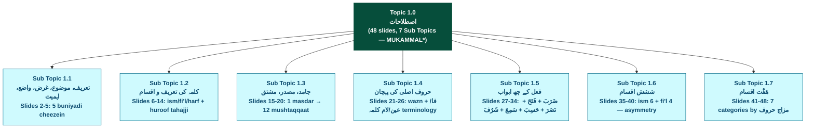

**Reading guide:**
- **Root (emerald)** — **Topic 1.0** branding + 48-slide span + 7 Sub Topics count. **MUKAMMAL\*** marker has asterisk indicating fence (structural inference, NOT PDF-explicit on p-034). See Status block + notes.md Slide 48 milestone block for fence details.
- **Main (teal)** — 7 Sub Topics:
 - **Sub Topic 1.1** (Slides 2-5, p-018-019): 5 buniyadi cheezein (tareef + mauzu + gharaz + waadi + ahmiyat) — kisi bhi نیا fan parhne ke pehle 5 sawal answer karne ka classical convention.
 - **Sub Topic 1.2** (Slides 6-14, p-019-022): کلمہ ki tareef + 3 aqsaam (Ism/Fi'l/Harf) + huroof tahajji (sahih 25 + illat 3 = 28). Foundation classification system.
 - **Sub Topic 1.3** (Slides 15-20, p-023-024): Ism ki derivational morphology — Jamid (rigid) vs Masdar (verbal noun) vs Mushtaq (derived). Master rule: 1 masdar se 12 mushtaqqaat (6 fi'l + 6 ism).
 - **Sub Topic 1.4** (Slides 21-26, p-025-026): Wazn extraction system. Mauzun + Meezan + Wazn 3-term framework + فا/عین/لام کلمہ position terminology + حروف اصلی vs زائدہ distinction.
 - **Sub Topic 1.5** (Slides 27-34, p-027-029): فعل ke 6 canonical ابواب — derivation 3 ماضی waznein × possible مضارع = 9 logical → 6 مستعمل (3+2+1=6). Canonical names: ضَرَبَ / فَتَحَ / نَصَرَ / حَسِبَ / سَمِعَ / شَرُفَ (book's specific choice, NOT کَرُمَ training-default).
 - **Sub Topic 1.6** (Slides 35-40, p-030-031): حروف اصلی count → ششش اقسام (ism: 3 size × 2 = 6 qismein; fi'l: 2 size × 2 = 4 qismein; NO خماسی فعل asymmetry).
 - **Sub Topic 1.7** (Slides 41-48, p-032-034): مزاج حروف (letters ki nature) → هَفْت اقسام (7 categories: صحیح + مثال + اجوف + ناقص + لفیف + مہموز + مضاعف). Classical Sarf foundation ka practical synthesis convergence point — Sub Topics 1.2 + 1.4 + 1.6 ki theory apply + extend.

**Mohim baat — yeh chart kyun important hai:**

> Topic 1.0 ka **end-to-end bird's-eye-view** — Sarf ke foundational concepts ka complete map. Chart dekh kar 4 cheezein samjho:
> - **Sarf ka foundation framework** — kalimah (1.2) → derivational morphology (1.3) → structural classification (1.4-1.7). Yeh sequence Sarf ke saare advanced topics ka base hai (mzeed feeh paradigms, conjugation systems, sarf-e-saghir/kabeer, etc. — sab is foundation se build hote hain).
> - **3 sets of N-categorizations** (Sub Topics 1.5 + 1.6 + 1.7): 6 ابواب + ششش اقسام + هَفْت اقسام. Yeh classical Sarf ka standard sequence hai — har book ka different design choice; is kitab ne **شَرُفَ** vs کَرُمَ (canonical 6th باب) + **ششش** vs شش (spelling variant) + **هَفْت** vs ہفت (spelling variant) jaise specific choices kiye.
> - **Practical synthesis at Sub Topic 1.7** — sirf Sub Topic 1.7 ne preceding Sub Topics ki theory ko **apply** kiya: حرف علت (1.2) + kalimah positions (1.4) + ثلاثی/رباعی (1.6). Yeh "convergence point" pattern Topic 1.0 ka structural design hai.

**Density:** 8 nodes (1 root + 7 main with 3-line labels), 2 color roles (root/main), no subgraphs — well within 16-node topic-overview limit. **Capstone design**: minimum node count + maximum coverage per node label.

**Verbatim discipline checks:**
- **Source pattern for leaf line-2 labels** (Sub Topic identity): Each leaf uses the **Sub Topic-level branding label** from the SUB-TOPIC HEADER BAR (consistently displayed across all slides in that Sub Topic) + Sub-Topic cover slide title. **NOT Slide 1 TOC row labels** — Slide 1 TOC small-font row labels are `[?]`-flagged in notes.md (Slide 1 Status block). Sub-Topic-level branding is the more reliably-attested anchor (appears on dozens of slide header bars + cover slides verbatim).
- **All Arabic terms PDF-verbatim:**
 - Topic 1.0 = "اصطلاحات" (Slide 1 cover title verbatim, large-font — not `[?]`).
 - 7 Sub Topic names (header-bar branding sources):
 - 1.1 "تعریف، موضوع، غرض، واضع، اہمیت" (Slide 2 cover bar + Slide 3 visible 5-word phrase confirmed).
 - 1.2 "کلمہ کی تعریف و اقسام" (Sub Topic 1.2 cover area Slides 6+; notes.md TOC).
 - 1.3 "جامد، مصدر، مشتق" (Slide 15 cover verbatim).
 - 1.4 "حروف اصلی کی پہچان" (notes.md TOC + Slide 23 header content; Slide 1 TOC row uses `[?]`-flagged "وزن کے ذریعے..." prefix that's small-font).
 - 1.5 "فعل کے چھ ابواب" (Sub Topic 1.5 HEADER BAR consistently across Slides 27-34; notes.md TOC; Slide 30 closing line *"ان کو چھ باب کہتے ہیں"*).
 - 1.6 "ششش اقسام" (Sub Topic 1.6 HEADER BAR consistently across Slides 35-40; Slide 36 transition formally introduces).
 - 1.7 "هَفْت اقسام" (Sub Topic 1.7 HEADER BAR consistently across Slides 41-48; Slide 42 paragraph 1 formally introduces).

 - 7 هَفْت categories (صحیح + مثال + اجوف + ناقص + لفیف + مہموز + مضاعف): Slide 42 verbatim.

- **Root node MUKAMMAL\* asterisk** — explicit fence marker pointing to Status block clarification: Topic 1.0 MUKAMMAL is; Sub Topic 1.7 is last per Slide 1; Slide 48 = standard Sub Topic khatima pattern → likely Topic-closure). **NOT PDF-explicit on p-034**. Nazir physical Slide 49+ confirm pending.
- **NO Topic 2.0 specifics** — chart limited to Topic 1.0 scope; "Topic 2.0 likely follows" mentioned only in commentary, not as a node.
- **NO surface phonetic forms / forward conjugation paradigms** — chart preserves morphological-root teaching method consistent with Sub Topics 1.5 + 1.7 discipline.

- Slide 1 (p-018) ki TOC table = 7 Sub Topics formally listed
- Sub Topic 1.7 = last per Slide 1 table position
- Slide 48 = Sub Topic 1.7 khatima exercise bar (parallel to Slides 5/14/20/26/34/40 prior Sub Topic exercise bars — standard pattern)
- → Sub Topic 1.7 khatime ke saath Topic 1.0 likely closure

**Cross-link to Charts 1-12 + nakshah Slides 46-47**:
- Chart 1 (Slide 7 — Kalimah 3 aqsaam) → Sub Topic 1.2 leaf
- Chart 2 (Slides 8-9 — Fi'l 3 taqseemein) → Sub Topic 1.2 leaf
- Chart 3 (Slide 12 — Huroof taqseem) → Sub Topic 1.2 leaf
- Chart 4 (Slide 11 — Waa'i mnemonic) → Sub Topic 1.2 leaf
- Chart 5 (Slides 16-19 — Masdar derivation tree) → Sub Topic 1.3 capstone (formally MUKAMMAL chart)
- Chart 6 (Slides 22-23 — Wazn extraction) → Sub Topic 1.4 capstone
- Chart 7 (Slides 30-31 — 6 ابواب overview) → Sub Topic 1.5 capstone
- Chart 11 (Slides 36-39 — Sub Topic 1.6 combined ism + fi'l) → Sub Topic 1.6 capstone
- Chart 12 (Slides 42-47 — Sub Topic 1.7 هَفْت اقسام master) → Sub Topic 1.7 capstone
- **Chart 13 (this chart)** → **Topic 1.0 capstone** — Sub Topic-level charts ko combine karta bird's-eye-view mein.
- **Nakshah Slides 46-47** = Sub Topic 1.7 ki PDF-attested visual consolidation (book ka own structural table); Chart 12 is Mermaid representation of similar conceptual mapping.

Nazir physical book se final-confirm kare:
- **(a)** Slide 49+ par Topic-level explicit closure announcement ya direct Topic 2.0 cover slide
- **(b)** Topic 2.0 ka aaghaaz par koi specific content 

---

*Sub Topic Capstone Charts complete: Chart 5 (1.3) + Chart 6 (1.4) + Chart 7 (1.5) + Chart 11 (1.6) + Chart 12 (1.7). Sub Topic 1.1 + 1.2 are foundational (no capstone needed beyond Charts 1-4). **Chart 13 = Topic 1.0 capstone = MUKAMMAL state**.*
